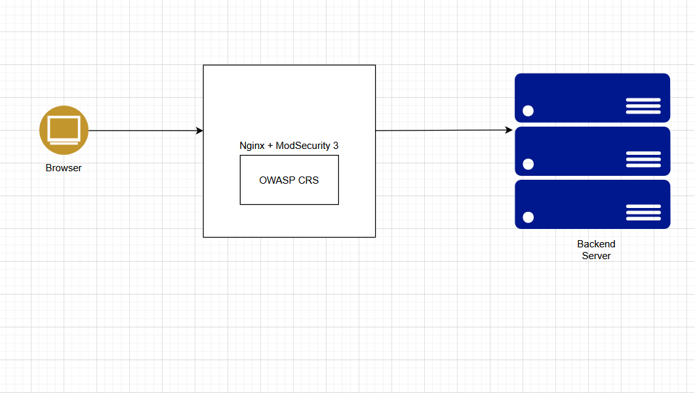

# Nginx-with-Modsecurity-3-OWASP-CRS-on-Ubuntu-24.04-installation



Step 1: Update the System and Install Required Libraries
```
sudo apt update && sudo apt upgrade -y
```
Install Required Libraries for ModSecurity 3:
```
sudo apt install libpcrecpp0v5 -y
sudo apt install gcc make build-essential autoconf automake libtool libcurl4-openssl-dev liblua5.3-dev libfuzzy-dev ssdeep gettext pkg-config libgeoip-dev libyajl-dev doxygen libpcre2-16-0 libpcre2-dev libpcre2-posix3 zlib1g zlib1g-dev -y
```
Install ModSecurity 3
Clone ModSecurity Repository:
```
cd /opt && sudo git clone https://github.com/owasp-modsecurity/ModSecurity.git
cd ModSecurity

sudo git submodule init
sudo git submodule update

sudo ./build.sh
sudo ./configure

sudo make
sudo make install
```
Download ModSecurity-Nginx Connector

Next, download the ModSecurity-Nginx connector to integrate ModSecurity with Nginx.
```
cd /opt && sudo git clone https://github.com/owasp-modsecurity/ModSecurity-nginx.git
```
Install Nginx

We'll install the latest version of Nginx from the Ondrej PPA repository.
Add Repository and Install Nginx:
```
sudo add-apt-repository ppa:ondrej/nginx -y
sudo apt update
sudo apt install nginx -y
```
We can enable with systemctl to start nginx when our server up
```
sudo systemctl enable nginx
sudo systemctl status nginx
```
We also need to check our nginx version, to match our nginx build manual later on.
```
sudo nginx -v
nginx version: nginx/1.26.3

```
Download nginx source code

We should download source code that match version on nginx we recently installed.
```
cd /opt && sudo wget https://nginx.org/download/nginx-1.26.3.tar.gz
sudo tar -xzvf nginx-1.26.3.tar.gz
cd nginx-1.26.3
```
Build Nginx with ModSecurity

Configure and build Nginx with ModSecurity support.
```
sudo ./configure --with-compat --add-dynamic-module=/opt/ModSecurity-nginx

sudo make
sudo make modules
```
Next, we copy the modules to nginx modules-enabled, also copy configuration of modsecurity and unicode.
```
sudo cp objs/ngx_http_modsecurity_module.so /etc/nginx/modules-enabled/

sudo cp /opt/ModSecurity/modsecurity.conf-recommended /etc/nginx/modsecurity.conf

sudo cp /opt/ModSecurity/unicode.mapping /etc/nginx/unicode.mapping
```
Enable ModSecurity in nginx.conf

Next, we edit configuration of nginx to load module of modsecurity
```
sudo nano /etc/nginx/nginx.conf
```
add this line to main configuration.
```
load_module /etc/nginx/modules-enabled/ngx_http_modsecurity_module.so;
```
then, we also need to modify the server block to activate modsecurity.
```
sudo nano /etc/nginx/sites-enabled/default

modsecurity on;
modsecurity_rules_file /etc/nginx/modsecurity.conf;
```
and also, edit /etc/nginx/modsecurity.conf to change SecRuleEngine to On.
```
sudo nano /etc/nginx/modsecurity.conf

SecRuleEngine On
```
after that we can our nginx configuration and restart nginx server
```
sudo nginx -t

sudo systemctl restart nginx
```
 Download OWASP CRS (Core Rule Set)

Download the OWASP CRS to protect the web application.
```
sudo git clone https://github.com/coreruleset/coreruleset.git /etc/nginx/owasp-crs
```
then we copy the configuration.
```
sudo cp /etc/nginx/owasp-crs/crs-setup.conf{.example,}
```
and we need to update our modsecurity configuration to load owasp crs.
```
sudo nano /etc/nginx/modsecurity.conf

Include owasp-crs/crs-setup.conf
Include owasp-crs/rules/*.conf
```
last, we check nginx configuration,
```
sudo nginx -t
```


To test if ModSecurity is working, try accessing the server and adding a shell command to the URL, e.g.,:
```
https://ip_address/as.php?s=/bin/bash
```
If ModSecurity is functioning, a 403 Forbidden error will be shown, indicating the request was blocked.
View ModSecurity Logs:

You can view detailed logs of ModSecurity for blocked requests:
```
sudo tail -f /var/log/modsec_audit.log
sudo tail -f /var/log/nginx/error.log
```

To block the IP address 103.101.15.218 using ModSecurity, follow these steps:
Step-by-Step Instructions:

    Edit the ModSecurity Configuration File:

        The ModSecurity configuration file is typically located at /etc/nginx/modsecurity.conf. Open this file in a text editor.
```
sudo nano /etc/nginx/modsecurity.conf
```
Add the IP Blocking Rule:

    Add the following rule to block the IP 103.101.15.218. Place it anywhere in the file (ideally in a section where you're managing custom rules, like at the end of the file).
```
SecRule REMOTE_ADDR "@ipMatch 103.101.15.218" \
    "id:1001,deny,status:403,msg:'Blocking IP 103.101.15.218',severity:2"
```
Explanation:

    SecRule: The ModSecurity rule directive.

    REMOTE_ADDR: Refers to the client's IP address.

    @ipMatch: The operator to match the specified IP.

    103.101.15.218: The IP address you want to block.

    id:1001: A unique rule ID. Ensure this number is not used elsewhere.

    deny: The action to take, which is to deny the request.

    status:403: The HTTP response status code for forbidden access.

    msg:'Blocking IP 103.101.15.218': A custom message that will be logged.

    severity:2: The severity level for the rule.

  ##   custome rule create
     🛡️ Adding Custom ModSecurity Rules for Nginx on Ubuntu 24.04

This guide outlines the steps to create and enable custom security rules (SQL Injection & XSS protection) using **ModSecurity v3** with **Nginx**.

---

## 📁 Step 1: Create the `modsecurity` Directory

```bash
sudo mkdir /etc/nginx/modsecurity
```

✍️ Step 2: Create Custom Rules File
```
sudo nano /etc/nginx/modsecurity/custom-rules.conf
```
Paste the following rules inside:
```
# Block basic SQL Injection
SecRule ARGS "@rx select.+from|union.+select|insert.+into|drop.+table" \
    "id:20001,phase:2,deny,status:403,msg:'SQL Injection Detected'"

# Block basic XSS
SecRule ARGS|REQUEST_HEADERS|XML:/* "@rx <script>|javascript:|onerror=|onload=" \
    "id:20002,phase:2,deny,status:403,msg:'XSS Attack Detected'"
```
Save and exit:
Ctrl + O, Enter, Ctrl + X
⚙️ Step 3: Include Custom Rule File in Main Configuration

Edit the main ModSecurity configuration:

```
sudo nano /etc/nginx/modsecurity.conf
```
At the bottom of the file, add the following line:
```
Include /etc/nginx/modsecurity/custom-rules.conf
```
✅ Alternatively, to include all rules from a folder:
```
Include /etc/nginx/modsecurity/*.conf
```
🧪 Step 4: Test Nginx Configuration
```
sudo nginx -t
```
🔁 Step 5: Restart Nginx to Apply Changes
```
sudo systemctl restart nginx
```
🔍 Step 6: Monitor ModSecurity Logs

To watch real-time logs for blocked requests:
```
sudo tail -f /var/log/modsec_audit.log
```
✅ Testing the Rules

Try accessing URLs like the following from a browser:

    SQL Injection test
```
http://your_server_ip/index.php?id=1 UNION SELECT password FROM users
```
XSS test
```
    http://your_server_ip/index.php?name=<script>alert(1)</script>
```
You should see a 403 Forbidden response if ModSecurity is blocking correctly.
📚 Notes

    All rules must have unique id: fields.

    You can categorize rules into separate files in the /etc/nginx/modsecurity/ folder.

    Logs are stored in /var/log/modsec_audit.log


    

# 🔐 ModSecurity Custom Rules for Nginx

This document outlines a set of custom **ModSecurity v3** rules to help protect your web application from common OWASP Top 10 vulnerabilities. These rules are designed to be added to your ModSecurity configuration when integrated with **Nginx**.

---

## ✅ 1. SQL Injection Protection

```apache
SecRule ARGS "@rx select.+from|union.+select|insert.+into|drop.+table" \
    "id:1002,phase:2,deny,status:403,msg:'SQL Injection Attempt Detected'"
```

🔍 Explanation:
Blocks requests that contain suspicious SQL keywords like SELECT FROM, UNION SELECT, DROP TABLE, etc.
✅ 2. Cross-Site Scripting (XSS) Protection
```
SecRule ARGS|REQUEST_HEADERS|XML:/* "@rx <script>|javascript:|onerror=|onload=" \
    "id:1003,phase:2,deny,status:403,msg:'XSS Attempt Detected'"
```
🔍 Explanation:
Detects malicious HTML/JavaScript injections such as <script>, onerror=, and onload=, and blocks them.
✅ 3. Remote Code Execution (RCE) Protection
```
SecRule ARGS|REQUEST_HEADERS "@rx /bin/bash|/usr/bin/perl|/usr/bin/python" \
    "id:1004,phase:2,deny,status:403,msg:'Remote Code Execution Attempt'"
```
🔍 Explanation:
Blocks any input attempting to reference local system binaries commonly used in RCE exploits.
✅ 4. Local File Inclusion (LFI) Protection
```
SecRule ARGS "@rx (\.\./|\.\.\\)" \
    "id:1005,phase:2,deny,status:403,msg:'LFI Attempt Detected'"
```
🔍 Explanation:
Prevents directory traversal attacks like ../../etc/passwd used to access system files.
✅ 5. Command Injection Protection
```
SecRule ARGS "@rx (;|\||`|\$\(.*\))" \
    "id:1006,phase:2,deny,status:403,msg:'Command Injection Attempt Detected'"
```
🔍 Explanation:
Blocks command injection attempts using shell operators such as |, ;, backticks, or $() expressions.
✅ 6. Bad Bot User-Agent Blocking
```
SecRule REQUEST_HEADERS:User-Agent "@pmFromFile bots-user-agents.txt" \
    "id:1007,phase:1,deny,status:403,msg:'Bad Bot Detected'"
```
🔍 Explanation:
Blocks web crawlers and bots based on the User-Agent header. Requires a file (bots-user-agents.txt) with bot strings.
```
📝 Sample bots-user-agents.txt:

AhrefsBot
MJ12bot
SemrushBot
DotBot

```
## only one ip allow rule
```
SecRule REMOTE_ADDR "!@ipMatch 103.101.19.229" \
    "id:1013,phase:1,deny,status:403,msg:'Only Allowed IPs can access'"

```


